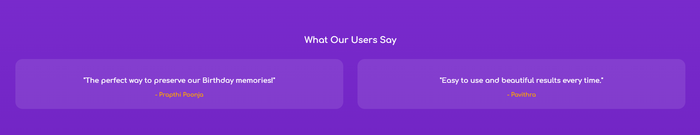

# 📖 Digital Scrapbook App

[Website](https://scrapvault.netlify.app/)

**A creative and interactive platform to preserve memories, design scrapbook pages, and collaborate in real time.**

## 🚀 Features

✅ **Custom Stickers & Doodles** – Personalize your scrapbook with creative elements.
✅ **Cloud Storage** – Securely save and access your scrapbook from anywhere.
✅ **Templates & Themes** – Pre-designed layouts to get started quickly.

---

## 🛠 Tech Stack

### **Frontend:**
- **HTML**
- **Tailwind CSS** 
- **JS**

### **Backend:**
- **Node.js**
- **=Firebase** 

### **Deployment:**
- **Frontend:** Vercel / Netlify
- **Backend:** Railway / Render
- **Database:** MongoDB Atlas / Firebase Firestore

---

## 🏗 Installation & Setup

```bash
# Clone the repository
git clone https://github.com/your-username/digital-scrapbook.git
cd digital-scrapbook
```
---


## 📸 Screenshots


.png)

.png)


---
```bash
## 🤝 Contributing
1. **Fork** the repository.
2. **Clone** your forked repo.
3. Create a new branch: `git checkout -b feature-name`
4. Commit your changes: `git commit -m "Added a cool feature"`
5. Push to your fork: `git push origin feature-name`
6. Open a **Pull Request**!
```
---

## 📜 License
This project is **open-source** under the MIT License.

---

